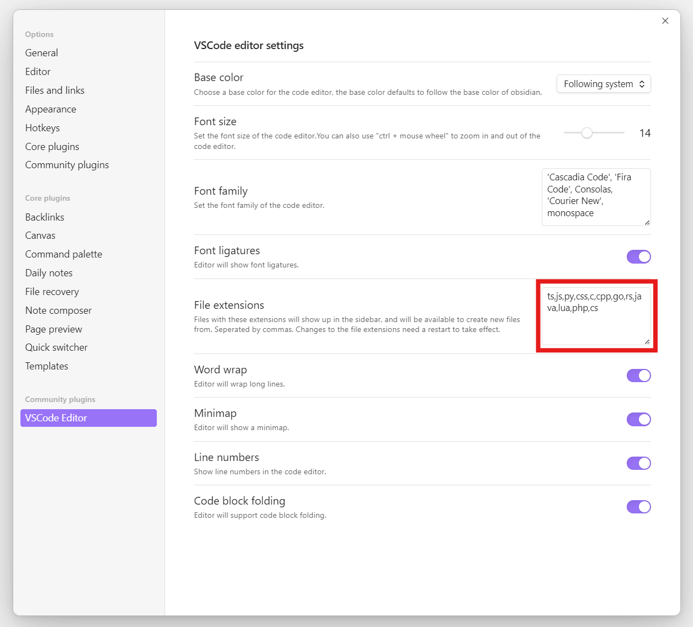

<h1 align="center">Obsidian VSCode Editor</h1>

    
    

    A third-party plug-in of Obsidian that provides viewing and editing functions for files in various code formats
     
    <a href="/README_cn.md">简体中文</a>
    ·
    <a href="/README.md">English</a>

## About the plugins

Obsidian by default does not support the viewing and editing of various code files, and Obsidian VSCode Editor was created to solve this problem. 

It is based on [Monaco Editor](https://microsoft.github.io/monaco-editor/) (VSCode Editor kernel) development, support for viewing and editing of various code format files, including but not limited to: ` C `, `C++`, `C#` , ` CSS `, ` Go `, ` HTML`, `Java`, `JavaScript`, `JSON`, `Python`, `Ruby`, `Rust`, `Shell`, `XML`, `YAML`, `ini`, etc.

You no longer have to open another editor just to view or edit a certain code file, everything is done in Obsidian.

## Basic features
- It **does not depend on** any third-party network services and can be used even when not connected to the internet.
- Support for viewing and editing files in various code formats, just like editing code with VSCode.
- Supports customization of the editor's theme colors, including light and dark themes.
- Allows customization of the editor's font family, font ligature support, font size, and provides a shortcut to adjust the font size using `Ctrl + mouse wheel`.
- Supports editing individual code blocks from any Markdown document (uses Obsidian Monospace font).
- Supports Internal links quick preview.
- Supports automatic code wrapping, and toggles it with `alt + z`.
- Provides the option to show/hide line numbers.
- Offers the choice to display/hide indent guides.
- Allows toggling the display of the code minimap.
- Supports shortcut icon buttons or commands for creating new code files.

## How to support different code file
The default support code file's extensions is `ts, js, py, css, c, cpp, go, rs, java, lua, php, cs`. you can configure for which file extensions to support in the plugin's setting panel.

## Supported Shortcuts
Most of the shortcuts are consistent with VS Code. Here are some of the supported shortcuts:

| Category     | Shortcut               | Action                    |
| ------------ | ---------------------- | ------------------------- |
| Ctrl         | `ctrl + c`             | Copy                      |
|              | `ctrl + x`             | Cut                       |
|              | `ctrl + v`             | Paste                     |
|              | `ctrl + s`             | Save                      |
|              | `ctrl + a`             | Select All                |
|              | `ctrl + f`             | Find                      |
|              | `ctrl + h`             | Replace                   |
|              | `ctrl + z`             | Undo                      |
|              | `ctrl + y`             | Redo                      |
|              | `ctrl + /`             | Toggle Comment            |
|              | `ctrl + d`             | Duplicate Line            |
|              | `ctrl + [`             | Decrease Indent           |
|              | `ctrl + ]`             | Increase Indent           |
|              | `ctrl + ↑`             | Move Line Up              |
|              | `ctrl + ↓`             | Move Line Down            |
|              | `ctrl + ←`             | Move Cursor Left by Word  |
|              | `ctrl + →`             | Move Cursor Right by Word |
|              | `ctrl + Backspace`     | Delete Word Left          |
|              | `ctrl + Delete`        | Delete Word Right         |
| Ctrl + Shift | `ctrl + shift + z`     | Redo                      |
|              | `ctrl + shift + k`     | Delete Current Line       |
|              | `ctrl + shift + [`     | Fold Code Block           |
|              | `ctrl + shift + ]`     | Unfold Code Block         |
|              | `ctrl + shift + enter` | Insert Line Above         |
|              | `ctrl + enter`         | Insert Line Below         |
| Alt          | `alt + z`              | Toggle Word Wrap          |

## Use screenshot

- **Light color theme**

- **Dark color theme**

- **Create code file**

## Supported Code Block Editing
 This plugin also supports editing individual code blocks from any Markdown document in the editor.
 You can just right click on any code block and click on "**Edit Code Block in VSCode Editor Plugin**".
 
 This will open a new modal with a Monaco Editor instance in which you can edit the code block, which will automatically sync back to the block in your document when you close the modal.
 

## Supported Internal links quick preview
You can add a internal link to a code file in obsidian, and hovering the cursor over the link for **quick preview**.

Code file will not appear  in file prompt list when intert Internal links. You need open `Detect all file extensions` setting.

## Installation

**Installation from Obsidian's community plugins**: 
1. Open Settings > community plugins
2. Turn off 'Safe mode'
3. Click 'Browse' button to browse plugins
4. Search for 'VSCode Editor'
5. Click 'Install' button
6. Once installed, close the plugins browse window and go back community plugins window, and activate the newly installed plugin below installed plugins list

**Manual installation**:
1. Enter the latest version of making download page [latest release](https://github.com/sunxvming/obsidian-vscode-editor/releases/latest)
2. Download the `obsidian-vscode-editor-x.y.z.zip` file, where `x.y.z` is the version number
3. Extract obsidian-image-toolkit folder from the zip to your vault's plugins folder `<vault>/.obsidian/plugins/` (Note: `.obsidian` folder may be hidden, you need to show it firstly)
4. Open Settings > community plugins, and reload and activate the plugin below installed plugins list

## Contact

If you've got any kind of feedback or questions, feel free to reach out via [GitHub issues](https://github.com/sunxvming/obsidian-vscode-editor/issues).
